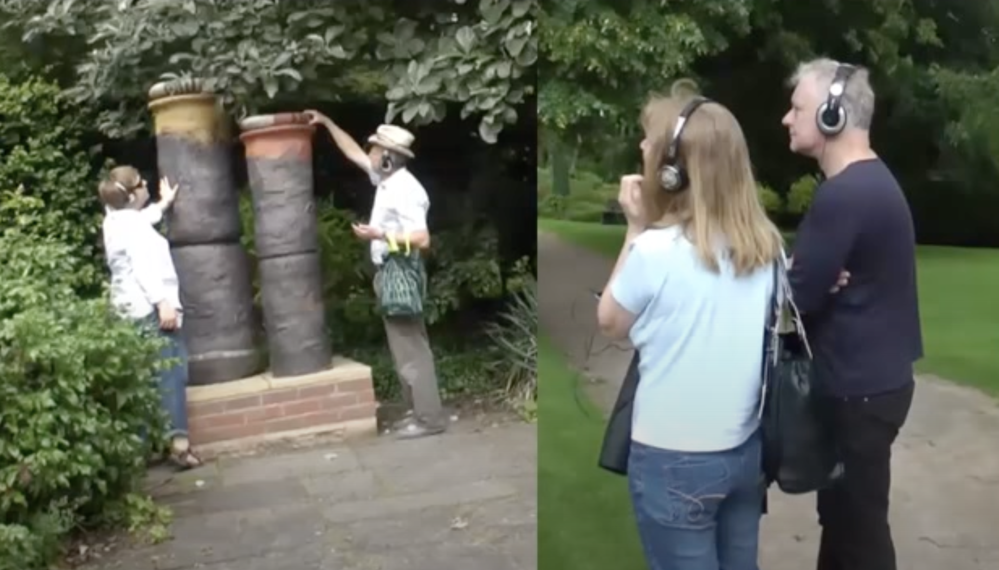
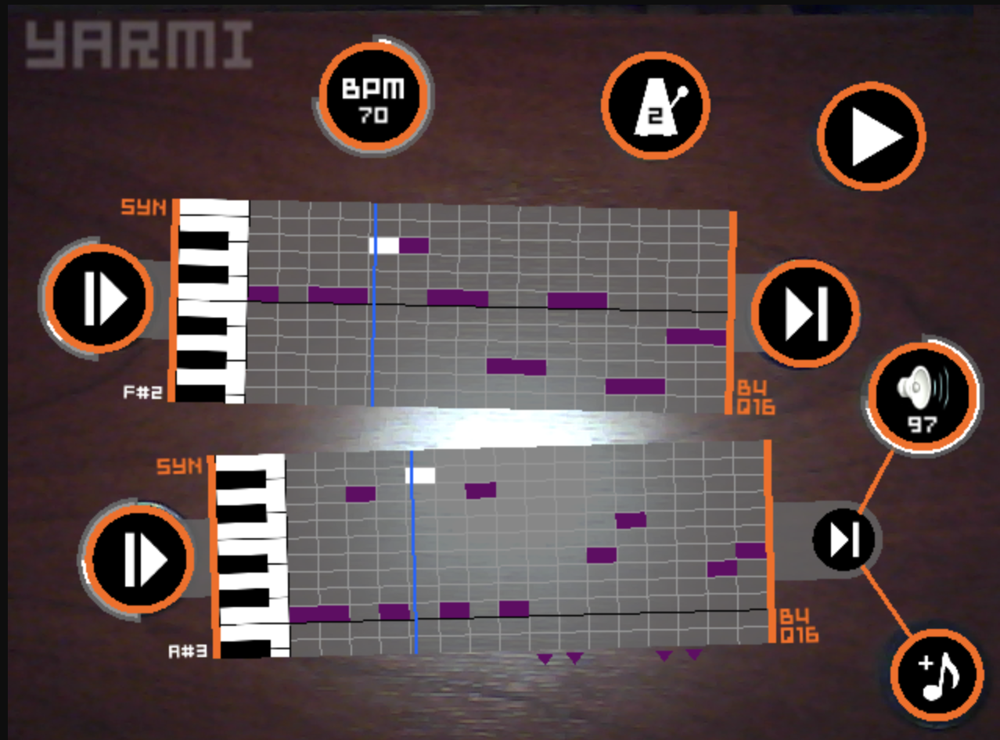
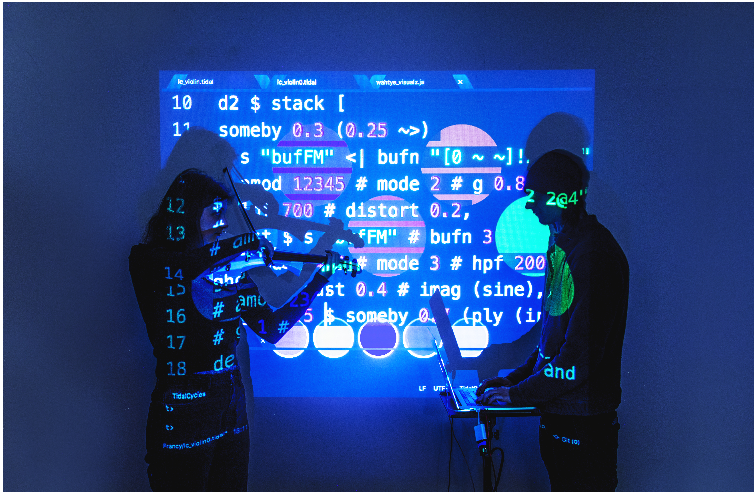

class: center, middle

# Spatial (Mixed Reality) Musical Instrument  in Design and Ensemble

Yichen Wang

https://yichenwangs.github.io
 
yichen.wang@anu.edu.au

<a href="https://charlesmartin.au/lab/">SMCC Lab</a>
  
School of Computing 
Australian National University  

???
Yichen - a phd student.
from Australia 
smcclab.
hci & creativity support tools and "entangled" nature of this human-machine relationship.
my preso today - share projects i've been working on and reflections i gained.

musically
---

class: center, middle

# What is Mixed Reality?  (Speicher et al., CHI'19)

???

- MR according to the Reality–Virtuality Continuum. VR or not.
- MR as a Combination of AR and VR.  mix of use.
- MR as “strong” AR. 
 number of environments, number of users, level of immersion, level of virtuality, degree of interaction, input, and output.
- "ubiquitous lived experience" with digital items that we interact everyday
- *music*
---

## Spatial Engagement with Digital Content in Reality

|.left[]|.center[]
|:--:|:--:| 

|.left[]|.right[]
|:--:|:--:| 

 (Fosh et al. CHI'13); (Laurenzow et al., NIME'09); (Glickman et al., NIME'17); (Wu and Freemand, NIME'21).

>

???
To put my work in context

I'm interested in how mixed reality is interpreted in computer music/creativity support tools
for artists/musicians researchers practices
"Support open interchange."
"Low threshold, high ceiling, and wide walls."

what is the conclusion of musical work here?
Different uses, works were unfolded from different perspectives, public, stakeholders, targeted ppl.

Better more in-depth understandings ../

---

# _isometric-sen_
### a self-contained digital musical instrument designed for a head-mouted AR system

--

- Autobiographical design: a first-person HCI approach based on the researcher's lived experience (Desjardins et al., TOCHI, 28(6),(2021))

--

  Wang, Y., & Martin, C. (2022). Cubing Sound: Designing a NIME for Head-mounted Augmented Reality. NIME 2022. https://doi.org/10.21428/92fbeb44.b540aa59

???

Mixed reality affordance 
I wanted to understand what was an instrument playing experience in mixed reality and what was a genuine design, through this intimate *free hand interaction*

- defining requirements using themselves as a user, getting an empathic understanding of a situation [6, 59], 
- experimenting and tinkering with ideas with their own bodies [16], 
- performing in context early prototypes, [7, 38] and 
- experiencing and testing a design through self-usage [3].

---
class: center, middle

<figure class="video_container">
  <iframe width="700" height="400" src="https://www.youtube.com/embed/zTFF5Vg7ctI?si=5pnRYLzVH67umCDQ&amp;start=3166" title="YouTube video player" frameborder="0" allow="accelerometer; autoplay; clipboard-write; encrypted-media; gyroscope; picture-in-picture; web-share" allowfullscreen></iframe>
</figure>

OzCHI 2022 Creativity Track

---
## Performing by others 

--

- A formal user study with 20 musicians about their musical performing experiences.

--

“a new view of how music can work in a different way”

“discover new possibilities and new combos within the same zone and the same instrument”.

--

- **Spatial dimension** of musical interface & **mobility** in music-making

???
How about other musicians using this instrument? What do they think about it?

Make it to entanglement and addressing the spatial and mobility of those felt quality of instrument experience, <- and look back at my work:

"mobility in music making" - musicians were aware the tension with space, and how that engage with music or sound they create through gestures in space!!!

--

  Wang, Y.,  Xi, M., Adcock, M., & Martin, C. 2023. Mobility, Space and Sound Activate Expressive Musical Experience in Augmented Reality. NIME 2023.

???

so far we only talk about individual experiences

say you want to perform with others, using other instruments, in the reality you are supposed to engage with it more

---
## Performing _with_ others?

--

<figure class="video_container">
<iframe width="700" height="400" src="https://www.youtube.com/embed/5QUpw_7yZqU?si=Cxig-FPmiIqYihtK&amp;start=57" title="YouTube video player" frameborder="0" allow="accelerometer; autoplay; clipboard-write; encrypted-media; gyroscope; picture-in-picture; web-share" allowfullscreen></iframe>
</figure>
beyond realms. // Sandy Ma & Yichen Wang @ACMC 2023

---
<!-- ## Performing with others in Digital Music Ensemble -->
## Ecological Dynamics in Digital Music Ensemble

|.center[]| .right[]
|:--:|:--:| 

--

- Multi-user collaborative interface: awareness, control of action, information availability. (Yuill & Rodgers, TOCHI'12; Xambó et al., TOCHI'13)

--

- Performance ecosystem, Agency. (Ardan Dal Ri el al. NIME'23; Frauenberger TOCHI'19)

--

- The "visibility" issue in digital orchestras (Dahl, NIME'12; Berthaut & Dahl NIME'20); Group creativity: musical gestures for communication. (Bishop 2018)

???

Social interaction, cultural implication
- continuation in process when making music
- human actors and artefacts, human offload our cognitive processes in the tools 
- entanglement

---
## Current work

<figure class="video_container">
<iframe width="700" height="400" src="https://www.youtube.com/embed/X6kQouxTiWM?si=fLiMj3K8Is1jwgan&amp;start=1" title="YouTube video player" frameborder="0" allow="accelerometer; autoplay; clipboard-write; encrypted-media; gyroscope; picture-in-picture; web-share" allowfullscreen></iframe>

</figure>

???

What will be entailed in terms of collaboration here, this limited space, and the inclusion of previous work together

agency study and entanglement "plurality"

What i want to understand, is what were the experiences for performers in computer music, visibility issue or not?
What are other potential patterns offload in this ecological system? and how we can better support this in mr

