class: center, middle

# On Tangible Sonic Space 

#### Spatial Musical Expression Design, Performance and in Co-creation

Yichen Wang

_yichen.wang@anu.edu.au_

School of Computing 
Australian National University  

Data 61, CSIRO

???

I'm Yichen, a third year PhD researcher in computer music from ANU. 

Today in my talk, I'd like to uncover the artistic side story behind my research work in new musical interface design in the MR environment.

Titled as ...

---

# Nerding Out ... 

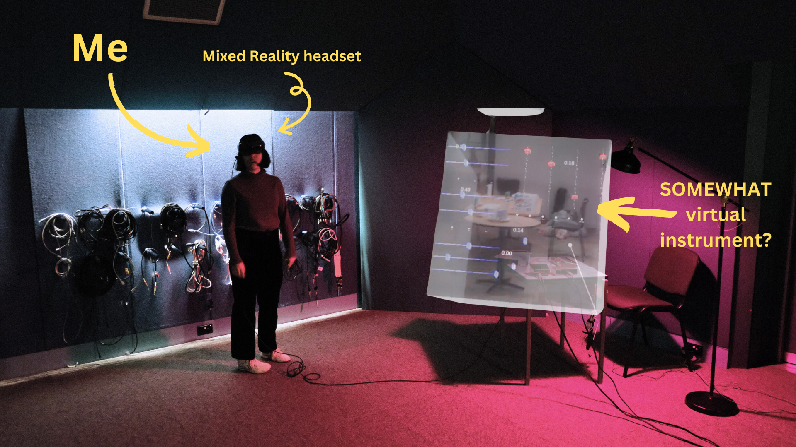

--

### How can you make music in mixed reality?

???

It begins with this picture:
Formally trained as a computer scientist with an artistic spirits in my soul,
I got really hooked up by the question - how can you make music in MR with advanced headset devices having freehand interaction.
What kind of futuristic instruments that can be created to support playful/creative experiences, can we make it more aesthetic?

Having these thoughts, I started to make things 
imagining myself as a musician trying to create tools to play - and got this one

obviously it was not the best given the inaccuracy

it was even worse than the electronic one - no haptic feedback
---

# isometric-sen
#### A self-contained digital musical instrument designed for a mixed reality headset

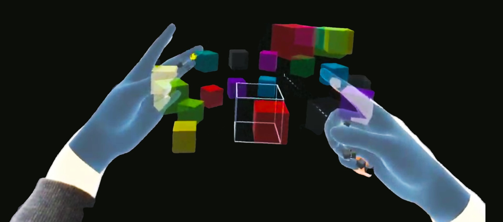
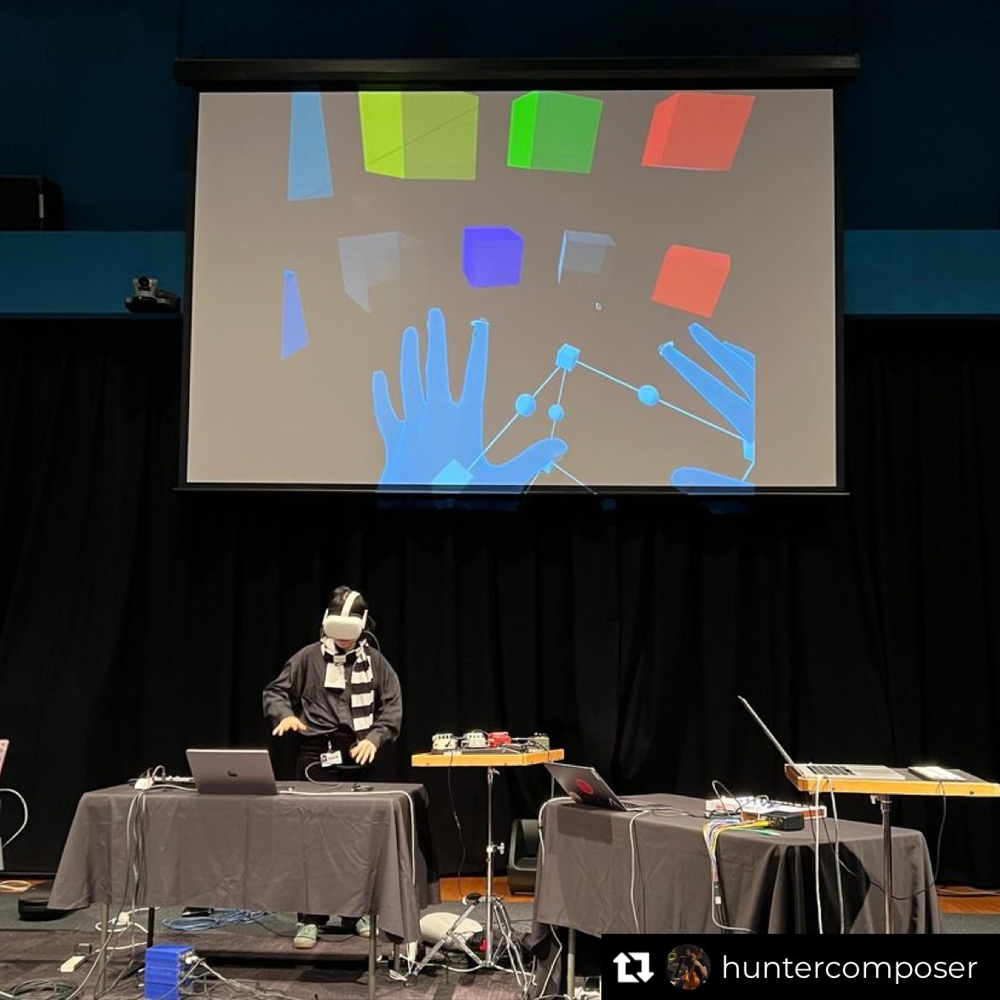

--

- Freehand interactions, poly-synthesised tonal texture/ambient. 

--

- Autobiographical design: a first-person HCI approach based on the researcher's lived experience (Desjardins et al., TOCHI, 28(6),(2021))

--

  Wang, Y., & Martin, C. (2022). Cubing Sound: Designing a NIME for Head-mounted Augmented Reality. NIME 2022.  
  https://doi.org/10.21428/92fbeb44.b540aa59

???

After a few iterations i landed with this instrument 
designed in a way that is ...

I'm still using the instrument as part of my practice.

Can we reach the virtuosity that what we normally do in music practice?
Mixed reality affordance 

---
## Performing by others 

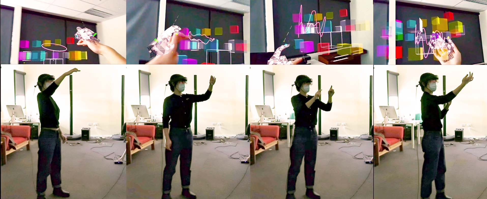

--

- A formal user study with 20 musicians about their musical performing experiences.

--

“a new view of how music can work in a different way”

“discover new possibilities and new combos within the same zone and the same instrument”

--

- The **_tagibility_** of **spatial dimension** of musical interface & **mobility** in music-making.

--

  Wang, Y.,  Xi, M., Adcock, M., & Martin, C. 2023. Mobility, Space and Sound Activate Expressive Musical Experience in Augmented Reality. NIME 2023.

???
How about other performers using this instrument? What do they think about it?

 a different perspective that consolidate the design by me in hinder sight.
It was them pointed out the tangibility of spatial dimension,
the awareness the tension with space, and how sound is created within this relationship. 

---
## Performing _with_ others

<figure class="video_container">
<iframe width="100%vw" height="400" src="https://www.youtube.com/embed/86yEZquWsPs?si=gj9SYXm2n6FBmqvd&amp;start=1578" title="YouTube video player" frameborder="0" allow="accelerometer; autoplay; clipboard-write; encrypted-media; gyroscope; picture-in-picture; web-share" referrerpolicy="strict-origin-when-cross-origin" allowfullscreen></iframe>
</figure>
cube. // feat. Charles Martin @ANU 2024, NIME2023
 
beyond realms. // Sandy Ma & Yichen Wang @ACMC 2023

???

So far we only talk about individual experiences
But music is fundamentally social
what i tried next is to put out this instrument in a collaborative context?

---
### Ecological Dynamics in Digital Musical Ensemble

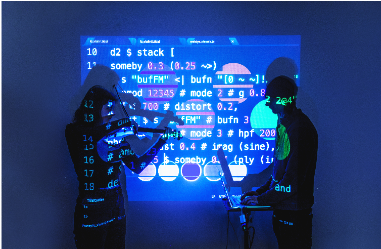

--

- Multi-user collaborative interface: awareness, control of action, information availability. (Yuill & Rodgers, TOCHI'12; Xambó et al., TOCHI'13)

--

- The "visibility" issue in digital orchestras (Dahl, NIME'12; Berthaut & Dahl NIME'20); Group creativity: musical gestures for communication. (Bishop 2018)

--

- Performance ecosystem, Entangled musical agency. (Ardan Dal Ri el al. NIME'23; Frauenberger TOCHI'19; Morrison & McPherson CHI'24)

???

Fine grounded problem have been addressed in nime and hci community.

First, it is about the design of the interface that can share.
Secondly, in the specific musical context, these are grounded into the communication issue.
Most importantly, as I believe we all know here, that it's not only about completing a task, it's performances that has many performative/experience-based flow qualities with in. 

---
### Networked Collaborative Musical Expression 
##### `*Bridging Human-AI Co-creation*`

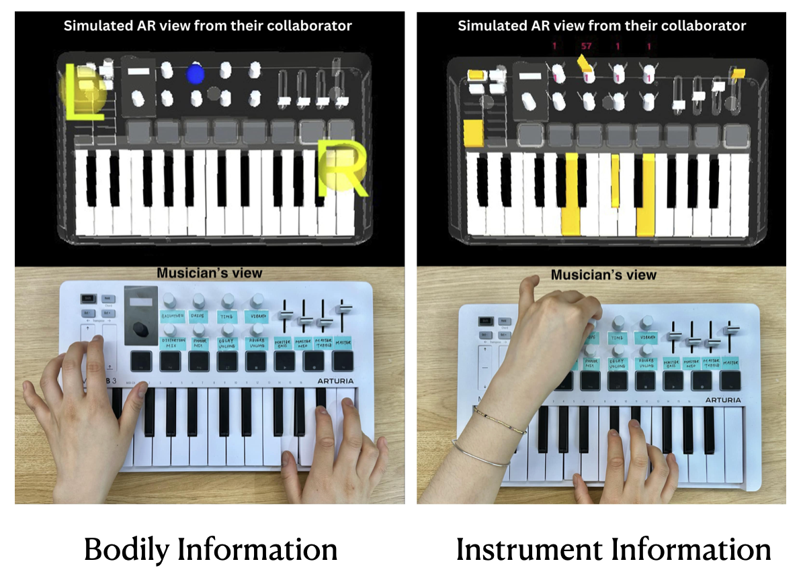

--

- **Spatial communication interface** for human and machine creativity.

- Two essential **musical interaction** information.

--

- Portable across various collaborative situations through a WebSocket **network infrastructure**.

???

Thus it led to my current work to creative a collaborative expression 
that i want it to go to a meta applicability -- works across different systems.

Spatial communication interface for human and machine creativity.
Two essential musical interaction information.
Portable across various collaborative situations through a WebSocket network infrastructure.

---

### Networked Collaborative Musical Expression
##### `*Bridging Human-AI Co-creation*`

<figure class="video_container">
<iframe width="700" height="400" src="https://www.youtube.com/embed/yP2YXmvPLz0?si=KaDu2hXbeFSlctxz" title="YouTube video player" frameborder="0" allow="accelerometer; autoplay; clipboard-write; encrypted-media; gyroscope; picture-in-picture; web-share" referrerpolicy="strict-origin-when-cross-origin" allowfullscreen></iframe>
</figure>
Unpspoken // Sandy Ma & Yichen Wang @ NIME 2024 (to appear)
 
Off-the-Self // Yichen Wang & Charles Martin @ AIMC 2024 (to appear)
 
Ongoing User Studies Snaps

---

# Outwards. 
--

### Beyond communication

--

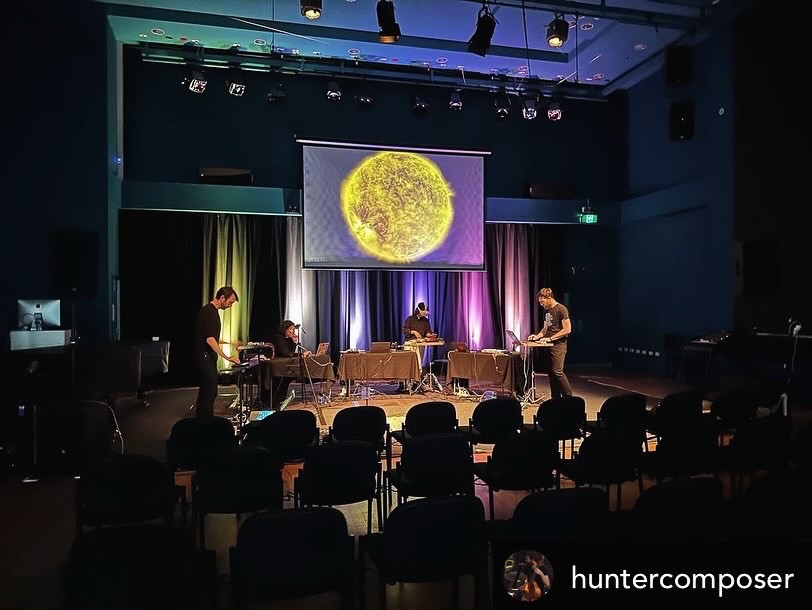

- The **metaphoric** presence of musicians in the mixed reality space.
--

- The mind-body reflection during the **sound making** process.
--

- It's **_always_** about creativity that brings back to us.

???

address back to tangibility and sound.

---
## Yichen Wang 
  

🪩 Spatial Musical Expression (AR/VR), Co-Creativity, HCI 

💼 Looking for **Postdoc** position early/mid next year. **Please get in touch!**

📬 yichen.wang@anu.edu.au | ins:yichenwangsss| https://yichenwangs.github.io 

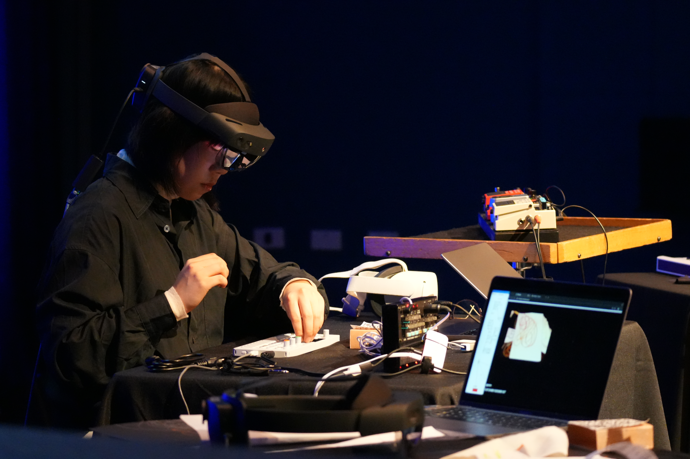
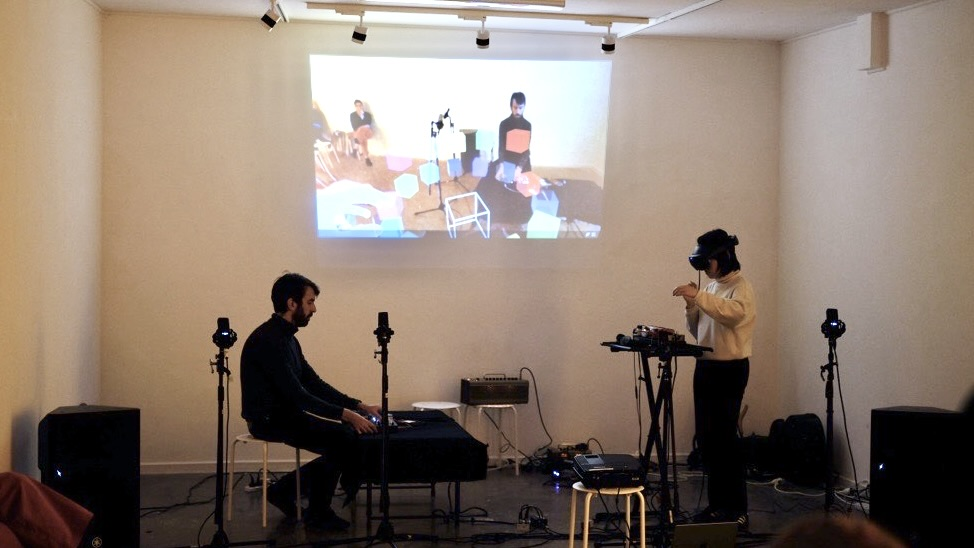
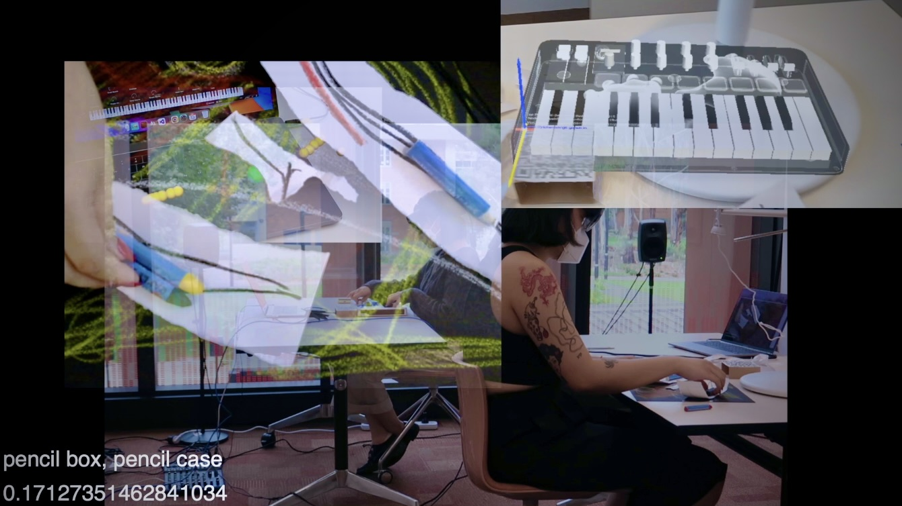

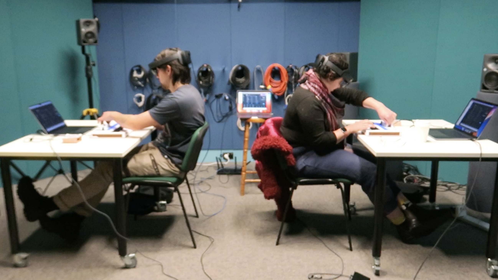

