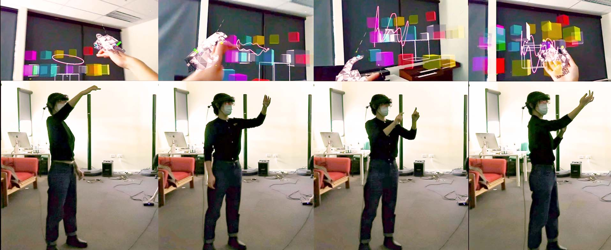

class: center, middle

# Spatial (Mixed Reality) Musical Instrument  in Design and Ensemble

Yichen Wang

https://yichenwangs.github.io

yichen.wang@anu.edu.au

SMCC Lab  
https://charlesmartin.au/lab/  
School of Computing 
<!-- College of Engineering, Computing and Cybernetics   -->
Australian National University  

???
Yichen - a phd student.
from Australia 
smcclab.
hci & creativity support tools and "entangled"
my preso today - share projects i've been working on and reflections i gained.

musically
---

class: center, middle

# What is Mixed Reality?  (Speicher et al., CHI'19)

???

- MR according to the Reality–Virtuality Continuum. VR or not.
- MR as a Combination of AR and VR.  mix of use.
- MR as “strong” AR. 
 number of environments, number of users, level of immersion, level of virtuality, degree of interac- tion, input, and output.

QR code and holosen
---

## Spatial Engagement with Virtual Content in Reality

|.cetner[]| .right[]|
|:--:|:--:| 
<!-- |.center[Fosh et al., CHI'13] | .center[Laurenzow et al., NIME'09]| -->

|.center[]|.right[]
|:--:|:--:| 
<!-- |.center[Glickman et al., NIME'17] |.right[Wu and Freemand, NIME'21]| -->

???
audio, visual, interaction
- Curated artistic experiences
  - augmented experience keywords and etc.
- Creativity support tools - digital musical instrument
  - musical learning, expressive interface, performance, collaboration

---

# _isometric-sen_
### a self-contained digital musical instrument designed for a head-mouted AR system

--

- Autobiographical design: a first-person HCI approach based on the researcher's lived experience (Desjardins et al., TOCHI, 28(6),(2021))

--

  Wang, Y., & Martin, C. (2022). Cubing Sound: Designing a NIME for Head-mounted Augmented Reality. NIME 2022. https://doi.org/10.21428/92fbeb44.b540aa59

???

Mixed reality affordance 
I wanted to understand what was an instrument playing experience in mixed reality and what was a genuine design, through *free hand interaction*

- defining requirements using themselves as a user, getting an empathic understanding of a situation [6, 59], 
- experimenting and tinkering with ideas with their own bodies [16], 
- performing in context early prototypes, [7, 38] and 
- experiencing and testing a design through self-usage [3].

---
class: center, middle

<figure class="video_container">
  <iframe width="700" height="400" src="https://www.youtube.com/embed/zTFF5Vg7ctI?si=5pnRYLzVH67umCDQ&amp;start=3166" title="YouTube video player" frameborder="0" allow="accelerometer; autoplay; clipboard-write; encrypted-media; gyroscope; picture-in-picture; web-share" allowfullscreen></iframe>
</figure>

OzCHI 2022 Creativity Track

---
class: center, middle

<figure class="video_container">
  <iframe width="700" height="400" src="https://www.youtube.com/embed/gQ5jUTbto1M?si=3XJBM6gyQZJC2WrN&amp;start=239" title="YouTube video player" frameborder="0" allow="accelerometer; autoplay; clipboard-write; encrypted-media; gyroscope; picture-in-picture; web-share" allowfullscreen></iframe>
</figure>

NIME2023 Music Track 

---
## Performing by others 

--

- A formal user study with 20 musicians about their musical performing experiences.

--

“a new view of how music can work in a different way”

“discover new possibilities and new combos within the same zone and the same instrument”.

--

- **Spatial dimension** of musical interface & **mobility** in music-making

???
While using this for my own practice, i

--

  Wang, Y.,  Xi, M., Adcock, M., & Martin, C. 2023. Mobility, Space and Sound Activate Expressive Musical Experience in Augmented Reality. NIME 2023.

???

so far we only talk about individual experiences

say you want to perform with others, using other instruments, in the reality you are supposed to engage with it more

---
## Performing _with_ others?

<figure class="video_container">
<iframe width="700" height="400" src="https://www.youtube.com/embed/FlxCFe836ig?si=0diDT1PseMeRqmW1" title="YouTube video player" frameborder="0" allow="accelerometer; autoplay; clipboard-write; encrypted-media; gyroscope; picture-in-picture; web-share" allowfullscreen></iframe>
</figure>

---
## Performing with others in Digital Music Ensemble

|.center[]| .right[]
|:--:|:--:| 
| ANU LENS | Reactable|

--

- The "visibility" issue in digital orchestras (Dahl, NIME'12; Berthaut & Dahl NIME'20)

--

- Group creativity: musical gestures for communication (Bishop 2018)

--

- Multi-user collaborative interface: awareness, control of action & information availability. (Yuill & Rodgers, TOCHI'12; Xambó et al., TOCHI'13)

--
---
## Spatial Music Collaboration?

---
## Next

